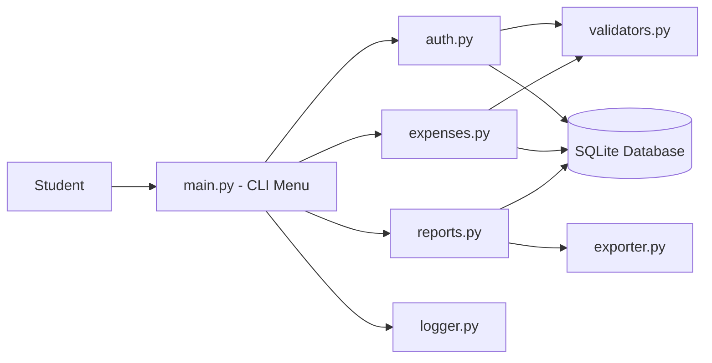

# Student Expense Tracker (CLI)

A simple, secure, command-line application that helps students record their daily expenses, stay within a monthly budget, and understand where their money goes.

> **Author:** YOUR NAME  |  **Reg. No.:** YOUR REG NUMBER  |  **Course:** YOUR COURSE NAME & CODE

---

## Table of Contents

1. [Overview](#overview)
2. [Features](#features)
3. [Technologies Used](#technologies-used)
4. [Project Structure](#project-structure)
5. [Prerequisites](#prerequisites)
6. [Installation and Setup](#installation-and-setup)
7. [Running the Project](#running-the-project)
8. [Usage Guide](#usage-guide)
9. [Running the Tests](#running-the-tests)
10. [System Design](#system-design)
11. [Non-Functional Requirements](#non-functional-requirements)
12. [Screenshots](#screenshots)
13. [Troubleshooting](#troubleshooting)
14. [Future Enhancements](#future-enhancements)
15. [Documentation](#documentation)

---

## Overview

Many college students manage a fixed monthly allowance but have no easy way to see how much they have spent or on what. Spreadsheets are tedious and most expense apps need a phone, an internet connection, or a paid plan.

**Student Expense Tracker** solves this with a lightweight terminal application. A student can create an account, set a monthly budget, log expenses by category, and get summaries and overspending alerts. All data is stored locally in an SQLite database, so the app works offline with no extra setup.

The full problem statement, scope, and target users are described in [`statement.md`](statement.md).

## Features

The project is organised into three major modules:

**1. User and Account Management**
- Register a new account with a username and password
- Secure login (passwords are hashed, never stored in plain text)
- Set and update a personal monthly budget

**2. Expense Management (CRUD)**
- Add an expense (amount, category, date, note)
- View all expenses, or filter by month and category
- Edit an existing expense
- Delete an expense

**3. Reports and Analytics**
- Monthly spending summary
- Category-wise breakdown with percentages
- Budget alert when spending crosses the monthly limit
- Export expenses to a CSV file

**Additional highlights**
- Input validation on every field (amount, date, category)
- Error handling so invalid input never crashes the app
- Activity and error logging to a log file
- Unit tests for the core modules

## Technologies Used

| Purpose | Tool |
|---|---|
| Language | Python 3.10 or higher |
| Database | SQLite (built into Python) |
| Password hashing | `hashlib` (SHA-256 with salt) |
| Testing | `pytest` |
| Logging | Python `logging` module |
| Version control | Git and GitHub |

## Project Structure

```
expense-tracker/
├── README.md
├── statement.md
├── requirements.txt
├── .gitignore
├── main.py                 # Entry point and menu loop
├── src/
│   ├── __init__.py
│   ├── database.py         # SQLite connection and schema creation
│   ├── auth.py             # Registration, login, password hashing
│   ├── expenses.py         # Add / view / edit / delete expenses
│   ├── reports.py          # Summaries and analytics
│   ├── validators.py       # Input validation helpers
│   ├── exporter.py         # CSV export
│   └── logger.py           # Logging configuration
├── tests/
│   ├── test_auth.py
│   ├── test_expenses.py
│   └── test_reports.py
├── docs/
│   ├── diagrams/           # Architecture, use case, sequence, ER diagrams
│   └── screenshots/        # Screenshots used in this README
└── data/                   # Local database and logs (created at runtime)
```

## Prerequisites

Before you begin, make sure you have:

- **Python 3.10 or higher.** Check with:
  ```bash
  python --version
  ```
  (On some systems the command is `python3 --version`.)
- **Git**, to clone the repository. Check with:
  ```bash
  git --version
  ```
- A terminal (Command Prompt, PowerShell, macOS Terminal, or any Linux shell). No GUI is required.

## Installation and Setup

Follow these steps in order. They assume you are starting from scratch.

**Step 1: Clone the repository**

```bash
git clone https://github.com/YOUR-GITHUB-USERNAME/expense-tracker.git
cd expense-tracker
```

**Step 2: Create a virtual environment (recommended)**

This keeps the project's dependencies separate from the rest of your system.

```bash
python -m venv venv
```

Activate it:

- **Windows (Command Prompt):**
  ```bash
  venv\Scripts\activate
  ```
- **Windows (PowerShell):**
  ```powershell
  venv\Scripts\Activate.ps1
  ```
- **macOS / Linux:**
  ```bash
  source venv/bin/activate
  ```

You should now see `(venv)` at the start of your terminal prompt.

**Step 3: Install dependencies**

```bash
pip install -r requirements.txt
```

**Step 4: Configuration**

No manual configuration is needed. On first run, the app automatically creates:

- `data/expenses.db`: the SQLite database with all required tables
- `data/app.log`: the log file

## Running the Project

From the project root folder, run:

```bash
python main.py
```

(Use `python3 main.py` if `python` does not work on your system.)

You will see the main menu. Follow the on-screen prompts.

## Usage Guide

A typical session looks like this:

1. **Register**: choose *Register*, then enter a username and password.
2. **Login**: log in with the same credentials.
3. **Set budget**: choose *Set Monthly Budget* and enter an amount (for example `5000`).
4. **Add expenses**: choose *Add Expense* and enter the amount, category (Food, Travel, Books, Entertainment, Other), date (`YYYY-MM-DD`), and an optional note.
5. **View or edit**: choose *View Expenses* to list them, then *Edit* or *Delete* by expense ID.
6. **Reports**: choose *Monthly Summary* or *Category Breakdown*. If you exceed your budget, an alert is displayed.
7. **Export**: choose *Export to CSV*. The file is saved in the `data/` folder.
8. **Logout / Exit**: choose *Exit* to close the app safely.

### Sample interaction

```
=== Student Expense Tracker ===
1. Register
2. Login
3. Exit
Enter choice: 2
Username: aarav
Password: ********
Login successful. Welcome, aarav!

--- Main Menu ---
1. Add Expense
2. View Expenses
3. Edit Expense
4. Delete Expense
5. Monthly Summary
6. Category Breakdown
7. Set Monthly Budget
8. Export to CSV
9. Logout
Enter choice: 1
Amount: 250
Category [Food/Travel/Books/Entertainment/Other]: Food
Date (YYYY-MM-DD): 2026-09-28
Note (optional): Lunch with friends
Expense added successfully.
```

## Running the Tests

Unit tests are written with `pytest` and cover authentication, expense operations, and reports.

Run all tests from the project root:

```bash
pytest tests/
```

For more detailed output:

```bash
pytest tests/ -v
```

All tests should pass. Tests use a temporary in-memory database, so your real data is never touched.

## System Design

**High-level architecture**



**Database schema**

| Table | Columns |
|---|---|
| `users` | `id` (PK), `username` (unique), `password_hash`, `salt`, `monthly_budget` |
| `expenses` | `id` (PK), `user_id` (FK to users.id), `amount`, `category`, `date`, `note` |

One user can have many expenses (one-to-many relationship).

The complete set of diagrams (use case, workflow, sequence, class/component, and ER) is available in [`docs/diagrams/`](docs/diagrams/).

## Non-Functional Requirements

| Requirement | How it is addressed |
|---|---|
| **Usability** | Clear numbered menus, prompts, and readable messages |
| **Reliability** | Data is persisted in SQLite; database operations are wrapped safely |
| **Security** | Passwords are salted and hashed; SQL queries are parameterised to prevent injection |
| **Error handling** | All user input is validated; exceptions are caught and reported without crashing |
| **Maintainability** | Modular code, docstrings, and consistent naming |
| **Logging** | Key actions and errors are recorded in `data/app.log` |

## Screenshots

> Replace these placeholders with your real screenshots (save them in `docs/screenshots/`).

| Main Menu | Add Expense | Monthly Report |
|---|---|---|
|  |  |  |

## Troubleshooting

| Problem | Solution |
|---|---|
| `python: command not found` | Try `python3` instead, or install Python from python.org |
| `pip: command not found` | Try `python -m pip install -r requirements.txt` |
| `ModuleNotFoundError` | Make sure the virtual environment is activated and dependencies are installed |
| PowerShell blocks activation script | Run `Set-ExecutionPolicy -Scope Process Bypass`, then activate again |
| Want to reset all data | Delete the `data/expenses.db` file; it is recreated on next run |

## Future Enhancements

- Graphical charts for spending trends
- Recurring expenses and reminders
- Multiple currencies
- Cloud backup and sync
- A web or mobile front end

## Documentation

- [`statement.md`](statement.md): problem statement, scope, target users, and high-level features
- [`docs/diagrams/`](docs/diagrams/): all design diagrams
- The detailed project report is submitted separately as a PDF on the VITyarthi portal.

---

*Built as part of the VITyarthi flipped course evaluation.*
